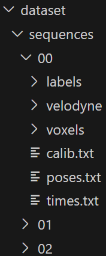
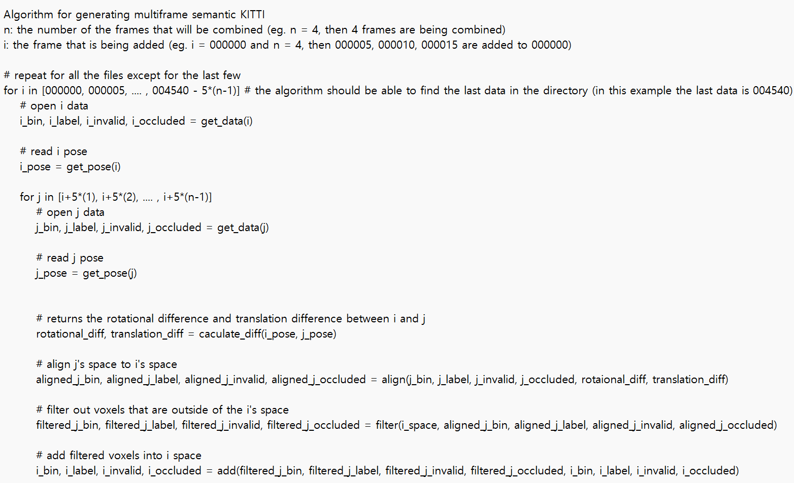

# SemanticKITTI-MultiFrameGeneration

## What is the purpose of this repository?!
This repository is used to <u>**generate MultiFrame semantic-KITTI Dataset**</u>, especially for the <u>**Semantic Scene Completion (SSC) Task**</u>.

## Visualization Result

## Prerequisites

## Environment Settings
- Create a conda environment
- Install Numpy and Tmux

## Dataset preparation
- First, let's download the original semanticKITTI dataset. You need to download all the data by clicking on the link below.
    - [voxels](http://www.semantic-kitti.org/assets/data_odometry_voxels.zip)
    - [calib.txt & times.txt](http://www.cvlibs.net/download.php?file=data_odometry_calib.zip)
    - [poses.txt](http://www.semantic-kitti.org/assets/data_odometry_labels.zip)
    
- Now that you have completed downloading the files, we need to make the structure of the dataset like the image shown below.  

## Running the code
### Converting the whole Sequences
If you run into any 'missing module' errors while running the code, then simply download the missing modules!  
Follow the steps below.
- First, create a tmux session
- Go into that session
- Open the 'generate_multiframe.sh' file
- Change the 4 arguments!
    - d: the path of the 'dataset' directory
    - o: the output path of the multiframe dataset
    - n: number of multiframes you want to combine
    - i: make this 5!
- Save the file and run the code below
- And run the code below
    - sh ./generate_multiframe.sh
- if you get an error try getting rid of 'CUDA_VISIBLE_DEVICES=1' in the 'generate_multiframe.sh' file.

### Converting just one Sequence
- CUDA_VISIBLE_DEVICES=1 python generate_multiframe_v2.py -d /mnt/ssd2/jihun/dataset/sequences/00 -o /mnt/ssd2/jihun/dataset_MF/sequences/00 -n 4 -i 5

## How does the code work?
- If you want to understand how the code works, I suggest you first understand the pseudo algorithm I made.
- The image below is the pseudo algorithm that I made before creating the actual code.
- I think it is very important to create a simple pseudo algorithm before coding something very complicated.
- The pseudo algorithm helps you not get lost in the complicated steps of coding. 

## What I need to do ✅, ⬜
This section is for my own reference. You do not need to read this sectin!
Dataset -> F(Dataset) -> MF Dataset 
- Prepare semantic-KITTI dataset ✅
- Use code to generate MF ⬜
- Check the output result ⬜